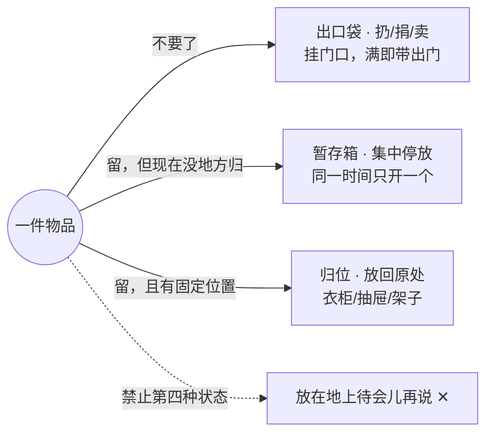
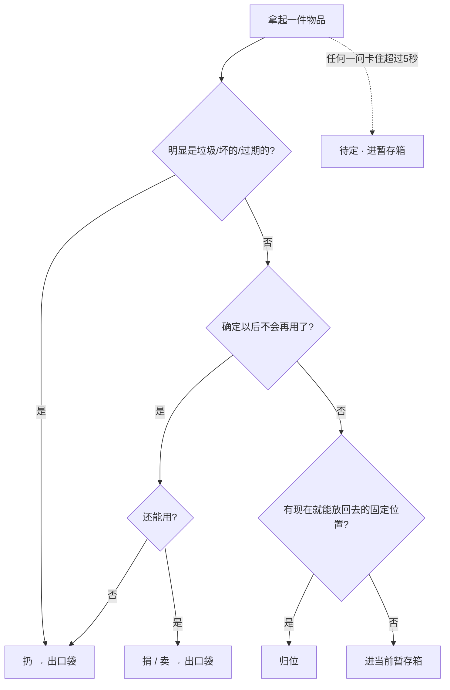

# 09 · 空间受限一畳循环法

> 适用场景：箱子堆满唯一的房间，门外空地也基本占满——**没有空间摊开分拣**，整理出的物品无法立刻归类。这是「腾挪式清理」，不是「铺开式整理」。
> 手机作业页（`/boxes` → 方法 tab）内有本方法的图示版：房间俯视图、三流图、决策树、七步卡片。

---

## 0 · 先看处境：为什么常规方法失效

房间被箱子堆满，门外小空地也满了。常规整理法（KonMari / 断舍离）都默认你有空地**把东西全部摊开**再集中比对，而你现在：

- 摊开 = 堵死通道，第一箱没清完就没有立足之地；
- 「先全部拿出来再分拣」回不去：拿出来的东西没有地方放；
- 归类需要目标空间（衣柜 / 架子），而目标空间本身还被箱子占着。

所以这套方法的目标不是「整理」，而是**让物品和空间单向流动起来**。

```
┌─────────────────────────┐   ┌──────────┐
│ ▣ ▣ ▣ ▣ ▣ │ 外面空地  │
│ ▣ ▣ [工作位] ▣ ▣ │  （也满了）│
│ ▣ ▣ ▣ ▣ ▣ │  ▫ ▫ ▫   │
└──────┬──────────┘   └──────────┘
       │ 通道（一人一箱宽）
    (出口袋) ← 挂在门口，伸手就够到
```

## 1 · 核心思路（一句话）

每拿起一件物品，**3 秒内**决定它进哪条流；出手即入流，**永远不放在地上**「待会儿再说」。

## 2 · 三条流：物品的唯一三个去向



- **出口流**：物理离开房间 = 空间真正回来。这是整个方法的发动机。
- **暂存流**：把「现在做不了的归类决定」推迟到有空地时——不是失败，是排期。
- **归位流**：有位置的直接放回，不经过任何中间堆放。

## 3 · 每件物品怎么判：决策树



规则大于个案：超过 5 秒就待定，别让一件卡住一箱。

## 4 · 一轮作业：七步 SOP

| # | 步骤 | 时长 | 做什么 | 为什么 | 常见错误 |
|---|---|---|---|---|---|
| 1 | **开道** | ~5min | 门口到工作位清出「一人+一箱」通道；出口袋挂门口 | 出口伸手可及，「满即带出」才做得动 | 跳过直接开箱，物品没处放第一轮就卡死 |
| 2 | **取箱就人** | ~1min | 一轮只选一箱，搬到工作位再开 | 就地掏会塌方；搬箱保证任何时刻只开一箱 | 嫌麻烦就地掏——复乱的最大来源 |
| 3 | **出口优先** | 头2min | 只挑明显垃圾/破损/过期，全进出口袋 | 先造箱内空隙，翻找不塌方；扔最快回收空间 | 翻到旧照片开始怀旧——垃圾先行，怀旧押后 |
| 4 | **三秒决策** | 15–20min | 逐件：录入名称 → 按处置按钮（扔/捐/卖/暂存/归位/待定） | 限时防呆，流水线不停 | 「万一以后用得上」——超 5 秒就待定 |
| 5 | **空箱回收** | ~1min | 清空的箱立刻压扁叠放，或转作暂存箱 | 空箱不压扁继续占一个工作位 | 留着「回头装东西」——5 分钟用不上就压扁 |
| 6 | **满即带出** | 5–10min | 出口袋满（或本轮扔件凑齐）立刻出门；App 出口区销账 | 物品物理离房空间才回来；这是发动机 | 「等周末一起扔」——袋子会被塞回房间 |
| 7 | **暂存二次清** | 另择整轮 | 主体清完、地面空出后，每个暂存箱单独开一轮归位 | 暂存是停车场不是仓库；限期防永久停放 | 不停开新暂存箱却从不二次清（≤2 个同时开） |

## 5 · 示例：一轮 25 分钟长什么样

| 时刻 | 动作 |
|---|---|
| 0:00 | 开道，挂出口袋，把第 3 箱搬到工作位 |
| 0:02 | 按下计时。先只挑垃圾：断衣架、过期券、碎数据线 → 出口袋 5 件 |
| 0:08 | 逐件录入：旧课本 → 卖；毛线团 → 待定；去年冬衣 → 暂存箱A；药盒 → 归位（玄关柜） |
| 0:20 | 第 3 箱已空出 1/3，翻乱的部分收拢；旁边第 4 箱先不动 |
| 0:25 | 铃响即停。本轮：录入 17 件 · 扔4 · 卖5 · 暂存6 · 归位2 · 待定0 |
| 0:30 | 扔件单独扎袋拎下楼。复盘一句话：房间没有变乱，回来了 4 件的空间 + 半箱空隙 |

注意：这一轮箱子没有「完成」也完全没关系——**最小胜利单位是「有东西出门」，不是「清完一箱」**。

## 6 · 节奏与完成标准

- 每轮 15–25 分钟计时，铃响即停，不透支；每天 1–2 轮就够
- 一轮的最小完成单位 = **有东西离开房间**，哪怕只有 2 件扔
- 按每轮推进 2–3 箱估算：50 箱 ≈ 20–25 轮 ≈ 每天 1–2 轮，两三周清完
- **战役完成标准**：所有箱子压扁或归架 · 出口区待出门 = 0 · 暂存箱 ≤ 2 个且已排二次清 · 走进房间不需要侧身绕路

## 7 · 常见问题

- **进暂存箱是不是等于逃避、白整理了？** 不是。暂存是把「现在没有条件做的归类决定」推迟到有空地时——决定没有消失，只是排期了。有二次清期限兜底（主体清完一周内），过期未处理默认捐。
- **为什么不能就地掏箱子？** 掏洞会让上面的箱子失去支撑塌方，掏出来的东西没处放最后摊在通道上。搬箱就人保证现场永远只有「一箱 + 一袋 + 一暂存箱」三个容器。
- **出口袋没满要不要等？** 扔不等满，每轮随手带出、绝不过夜；捐/卖可凑一批但别超一周——出口区数字挂着就是提醒你出门。
- **家人把东西塞回来？** 给暂存箱编号并公告：「箱内 = 待定，期限 X 月 X 日，过期默认捐」。把规则交给日期，不靠拉锯。
- **录入 App 会不会拖慢速度？** 录入只花 3 秒（名称 + 一个处置按钮），换来出口区自动记账、暂存内容可查、进度可视。纯垃圾不录也行——台账是工具不是任务。
- **50 箱会不会永远清不完？** 不会。20–25 轮收尾，每天 1–2 轮两三周。关键不是单日猛干，是「每天有一袋出门」。

## 8 · 方法 ↔ App 功能对照

| 方法概念 | 页面位置 |
|---|---|
| 轮次计时 | 作业屏计时器（每 30 秒自动上报，锁屏不丢） |
| 出口袋 | 「出口区」tab——待出门数字 = 袋子有多满 |
| 当前暂存箱 | 作业屏顶部输入框，换箱时改名（暂存箱A → B） |
| 三秒决策 | 每件物品下方六个大按钮：扔 / 捐 / 卖 / 暂存 / 归位 / 待定 |
| 箱子生命周期 | 未开封 → 清理中（按开始计时自动转）→ 已归类 → 已完成 |
| 满即带出 | 出口区「已带出」按钮——物品自动退役销账 |

## 与其他方法论的关系

- **断舍离**：提供「需要吗」的决策内核，本方法为其补充零空间下的物流方案；
- **KonMari**：心动判断可嵌入第 4 步决策树，但「按类集中」在腾挪期不可行，留到二次清；
- **5S**：本方法即「整理（Seiri）+ 清扫（Seiso）」在极限空间下的执行版；
- **FlyLady**：计时轮次与「出门一趟」的仪式感直接借用。
